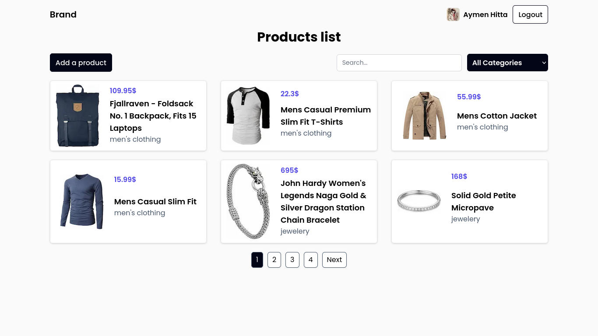

# assessment



## Project Overview: Web and Mobile Application Integration with Fake Store API

This project involves the development of a comprehensive web and mobile application that  interacts with the Fake Store API (fakestoreapi.com). The primary objective is to create a user-friendly platform that allows users to browse, search, and CRUD products from a simulated online store.
Current State of the Projects:

- Web Application: Fully implements all functional requirements.
- Mobile Application: Unfinished, due to time constraints.

Key Features:

- User Authentication: Implement secure user registration and login functionalities using both credentials and oauth.

- Product Browsing: Users can explore products, categorized for easy navigation. Each product will display essential details such as title, price, description, and an image.

- Search Functionality: A robust search feature will enable users to quickly find specific products by entering keywords or filtering by categories.

- CRUD operations: Authenticated users can create, read, update and delete products.

- Responsive Design: The web application will be designed to be fully responsive, ensuring an optimal user experience across various devices, including desktops, tablets, and smartphones.

- API Integration: The application will utilize the Fake Store API to fetch real-time product data.

## Setting Up the Projects on Your Local Machine

To get started with the project locally, follow these steps:

1. Install pnpm:

```shell
npm install -g pnpm
```

2. Clone the GitHub Repository: Clone the repository and navigate into the project directory:

```shell
git clone https://github.com/aymenhta/assessment.git
cd assessment
```

3. Setting Up the Web Application: Navigate to the web application directory and create a new environment file:

```shell
cd web/
touch .env.local
```

Inside the newly created .env.local file, provide the following environment variables:

```text
NEXTAUTH_SECRET=zW7ubDdqiAY5XcLkYlOnJP9+wQ1+GxrYV3xHQAD6os0=
NEXTAUTH_URL=http://localhost:3000

GITHUB_ID=
GITHUB_SECRET=

GOOGLE_CLIENT_ID=
GOOGLE_CLIENT_SECRET=

BASE_URL=https://fakestoreapi.com

WEBSITE_URL=http://localhost:3000
```

Note that, the following environmet variables (GITHUB_ID, GITHUB_SECRET, GOOGLE_CLIENT_ID, GOOGLE_CLIENT_SECRET) need to be provided in order for oauth to work.

4. Build and Run the Application:
Finally, build and start the web application using the following commands:

```shell
pnpm build
pnpm start
```

## Optimizations

1. **Lower Payload Size Equals Lower Latency:** Due to the limitations of the fakestoreapi functionality, I had to fetch the entire product list from the server. When the product list is large, this can lead to performance issues. To address this, I implemented client-side searching and pagination. Since I don't have control over the server, I utilized caching for a specific duration to avoid hitting the server every time the component renders. A more effective solution would be for the backend REST API to offer flexible resource options, such as allowing requests like fakestoreapi.com?page=1&size=5&sort=-id.

2. **Image Optimization:** Next.js provides built-in image optimization capabilities when the Sharp package is installed. This feature allows for efficient image handling out of the box.
